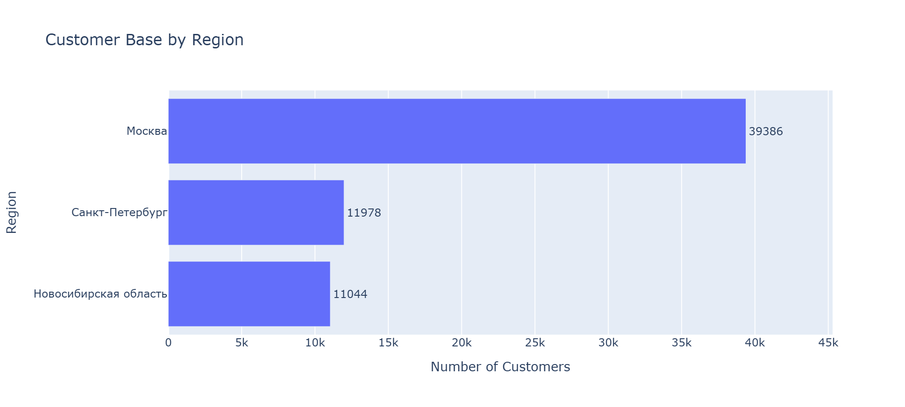
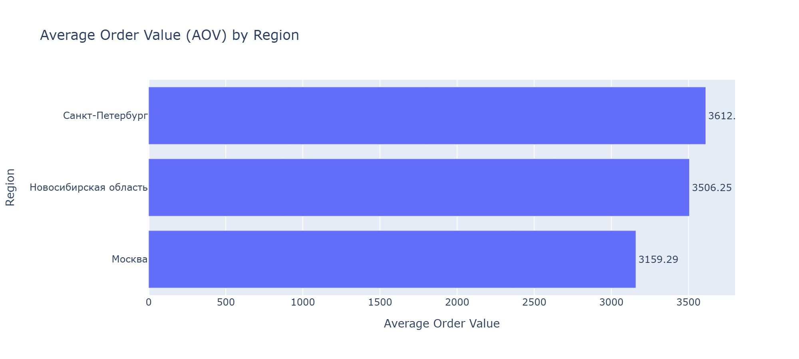
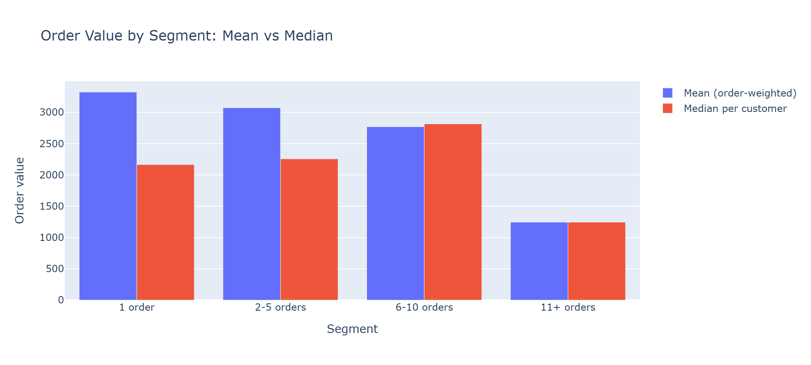
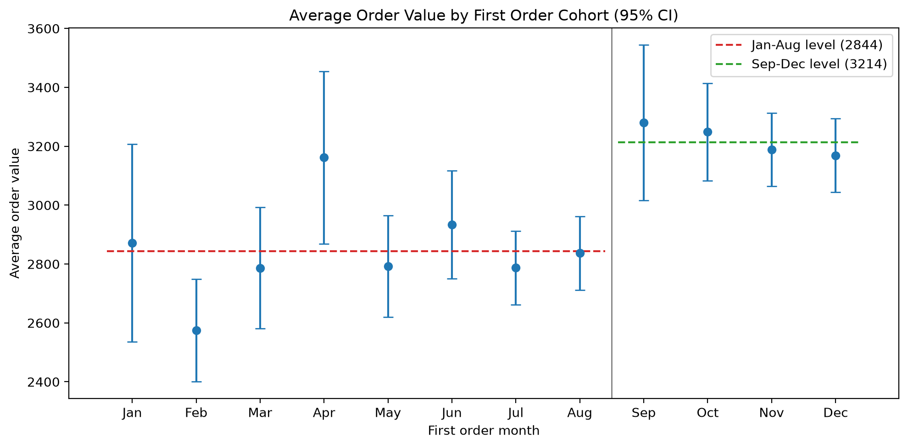
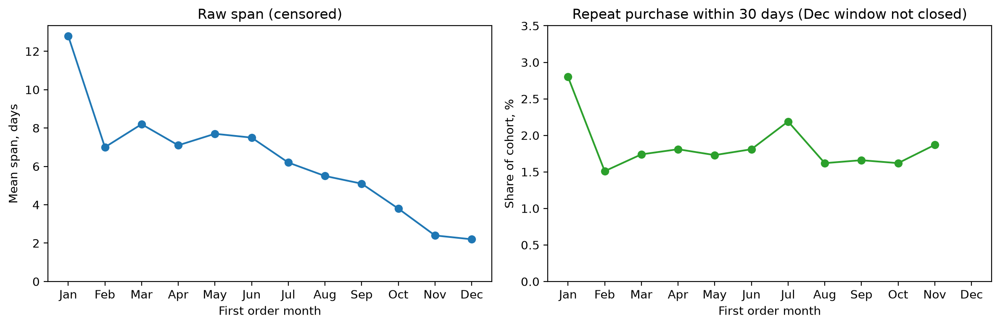

# Marketplace Customer Analytics

SQL-based customer analytics project focused on building a customer-level feature mart and solving four ad hoc analytical tasks for an e-commerce marketplace.

## Project Overview

The project consists of two main parts:

1. Building a customer-level feature mart using SQL.
2. Solving four ad hoc analytical tasks based on the resulting dataset.

The analysis covers customer purchasing behavior, order characteristics, payment methods, regional differences, and customer activity over time.

The complete exploratory analysis, visualizations, and interpretation of the results are available in:

`analysis/marketplace_analysis.ipynb`

The SQL scripts demonstrate both the construction of the customer feature mart and the analytical queries built on top of it.

Interactive versions of the charts: [view the notebook on nbviewer](https://nbviewer.org/github/deshiksergeev/marketplace-customer-analytics/blob/main/analysis/marketplace_analysis.ipynb)

## Key Findings

Every difference below is tested. Average order value is compared with the delta
method at the customer level; multi-group comparisons are Holm-corrected.

**Moscow's average order value lags both other regions by 11-14%** (3,159 against
3,612 in Saint Petersburg and 3,506 in Novosibirsk region, p < 1e-11 for both),
while holding 63% of the customer base. Saint Petersburg and Novosibirsk region
are indistinguishable from each other (p = 0.12), so the gap worth explaining is
Moscow's, not Saint Petersburg's lead.

**The one-order segment has a higher mean order value but a lower median than
repeat buyers** (3,324 vs 3,073 order-weighted, p = 7e-4; 2,165 vs 2,256 median,
p = 4e-4). Both effects are real and opposite: the top 1% of one-time buyers hold
10.8% of the segment's revenue, so the mean describes a rare large purchase
rather than a typical customer.

**Purchase frequency and order value are unrelated** among customers with three
or more orders (Spearman rho = 0.087, p = 0.28, n = 155). The top-15 ranking by
order value consists of low-frequency customers purely because of base rates
(12.5 of 15 expected under a permutation null, 13 observed, P = 0.53).

**Order value rose 13% for cohorts acquired from September 2023 onwards**
(2,844 to 3,214, p = 4e-12), a level shift present in all three regions rather
than monthly seasonality: 15 of the 16 Holm-significant pairwise differences
cross the August-September boundary.

**The apparent decline in customer retention across 2023 cohorts does not
exist.** The raw first-to-last-order span falls from 12.8 to 2.2 days only
because later cohorts are observed for less time. In a fixed 30-day window,
repeat purchase rates do not differ across cohorts (p = 0.75).

**Review scores fall in Q4 exactly when volume and order value peak** (4.32 in
August to 4.01 in November, p = 2e-19), and not because review coverage changed
(stable at 76-79%).

## Recommendations

1. **Investigate Moscow's order value gap before optimizing the other regions.**
   Moscow holds 63% of customers, so one percentage point of AOV there outweighs
   the same gain in both other regions combined. Next query: decompose regional
   AOV into category mix and within-category price using order-item data.
2. **Stop reporting the mean order value for the one-order segment on its own.**
   Report the median alongside it, or split the segment by order value band. The
   single number currently describes a tail, not a customer.
3. **Replace the raw activity span with repeat purchase in a fixed window in any
   cohort reporting.** The current metric manufactures a retention decline every
   month and makes recent acquisition look worse than it is. Exclude cohorts
   whose window has not closed.
4. **Test whether the Q4 rating drop is a fulfilment problem.** The joint timing
   of the volume peak and the satisfaction drop predicts the drop concentrates
   in late deliveries; `orders` carries both the actual and the estimated
   delivery date, so this is one query away.
5. **Do not run experiments on regional or cohort splits without a power check.**
   Order value has skewness 10.2 and a maximum 87 times the mean, and the
   smallest region has a third of Moscow's customers.


## Visuals

### Customer Base by Region

<p align="center">

</p>

### Regional Analysis

<p align="center">

</p>

### Order Value by Segment: Mean vs Median

<p align="center">

</p>

### Cohort Order Value with Confidence Intervals

<p align="center">

</p>

### Retention: Raw Span vs Fixed Window

<p align="center">

</p>

## Data

The project uses relational e-commerce data containing information about:

- customers;
- orders;
- order items;
- payments;
- reviews.

The analytical dataset is built at the customer × region grain: 62,408 rows
covering 62,400 distinct customers (8 customers ordered from more than one
top-3 region).

The original dataset contains:

- 99,000+ orders;
- 113,000+ order items;
- 104,000+ payments;
- 78,000+ reviews.

## Method

The environment does not allow persisting the mart as a table, so the ad hoc
queries run against `ds_ecom.product_user_features`, which has the same
structure. Its duration column is named `lifetime`; the mart calls the same
quantity `first_to_last_order_days`, since it is a span between orders and not a
customer lifetime.

The ad hoc queries return aggregates, which carry no within-group variance and
cannot support a significance test. `sql/analysis_exports.sql` extracts the same
population at the customer-region grain; the notebook runs its tests on those
extracts and uses the aggregate CSVs only to verify that the extracts reproduce
the queries.

## Customer Feature Mart

The customer-level feature mart combines transactional, behavioral, payment, and review information at the `customer × region` level.

`first_to_last_order_days` is the span between a customer's first and last order
within a region, computed as `MAX(order_purchase_ts)::DATE - MIN(order_purchase_ts)::DATE`.

It is deliberately not called a lifetime. It is zero by construction for the 97%
of customers with a single order, so its group average factorizes into the
repeat rate times the mean span among repeat customers and cannot separate the
two. It is also censored by the end of the data window. Retention is measured
instead by repeat purchase within a fixed window.

The main features include:

- first and last order timestamps;
- first-to-last order span in days;
- total number of orders;
- average order rating;
- number of orders with ratings;
- number and share of canceled orders;
- total order costs;
- average order cost;
- number of orders paid in installments;
- number of orders using promo codes;
- indicators of money transfer usage;
- indicators of installment usage;
- cancellation indicator.

The SQL workflow includes:

- filtering relevant orders;
- identifying the top three regions by order volume;
- aggregating customer-level features;
- correcting inconsistent review scores;
- calculating order-level costs including delivery;
- aggregating payment information;
- handling one-to-many relationships and potential row multiplication after joins;
- creating binary behavioral features;
- joining all feature groups into the final customer-level dataset.

## Ad Hoc Analysis

### 1. Customer Segmentation

Customers are segmented by the total number of orders:

- 1 order;
- 2–5 orders;
- 6–10 orders;
- 11+ orders.

For each segment, the analysis calculates:

- number of customers;
- average number of orders;
- average order cost across non-canceled orders.

The analysis helps compare purchasing intensity and order economics across customer segments.

### 2. Customer Ranking by AOV

Customers with at least three orders are ranked by average order value, computed as total delivered cost divided by the number of delivered orders.

The analysis returns the top 15 customers with the highest AOV and examines whether customers with a higher number of orders also tend to have a higher average order value.

### 3. Regional Analysis

The analysis compares marketplace performance across regions using:

- number of customers;
- number of orders;
- average order value;
- share of orders paid in installments;
- share of orders using promo codes;
- share of customers who canceled at least one order.

This analysis helps identify regional differences in customer behavior and payment preferences.

### 4. Customer Activity by First Order Month

Customers whose first order occurred in 2023 are grouped by the month of their first purchase.

For each cohort, the analysis evaluates:

- number of customers;
- number of orders;
- average order value;
- average order rating;
- share of customers using money transfers;
- mean first-to-last order span;
- repeat purchase rate within a fixed 30-day window.

This analysis is used to explore differences in customer behavior across first-order cohorts and identify potential seasonal patterns.

## Limitations

- 335 customers (0.5%) have every order canceled and therefore no order value.
- 21% of customer-region records have no review score; ratings are computed over
  the reviewed subset, whose coverage is stable across cohorts (76-79%).
- The customer × region grain cannot answer order-level or item-level questions:
  category mix, delivery times, basket composition.
- The data has an effective cut-off at 2023-12-31.

## Repository Structure

```text
marketplace-customer-analytics/
│
├── README.md
│
├── analysis/
│   ├── marketplace_analysis.ipynb
│   ├── customer_features.csv
│   ├── first_order_cohort_export.csv
│   ├── customer_segmentation.csv
│   ├── top_customers_by_aov.csv
│   ├── regional_statistics.csv
│   └── first_order_cohort_analysis.csv
│
├── images/
│   ├── customer_base_by_region.png
│   ├── customer_segmentation.png
│   ├── regional_analysis.png
│   ├── installment_usage_by_region.png
│   ├── promo_usage_by_region.png
│   ├── cancellation_rate_by_region.png
│   ├── customer_cohorts.png
│   ├── cohort_aov.png
│   └── retention_window_comparison.png
│
└── sql/
    ├── customer_feature_mart.sql
    ├── adhoc01_customer_segmentation.sql
    ├── adhoc02_top_customers_by_aov.sql
    ├── adhoc03_regional_statistics.sql
    ├── adhoc04_first_order_cohort_analysis.sql
    └── analysis_exports.sql
```

## Tools

- PostgreSQL, DBeaver;
- Python: pandas, NumPy, SciPy, Plotly, kaleido;
- Jupyter.
