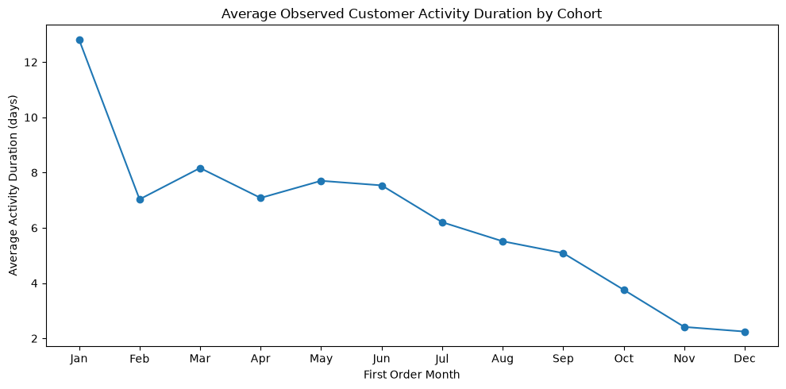

# Marketplace Customer Analytics

SQL-based customer analytics project focused on building a customer-level feature mart and solving four ad hoc analytical tasks for an e-commerce marketplace.

## Project Overview

The project consists of two main parts:

1. Building a customer-level feature mart using SQL.
2. Solving four ad hoc analytical tasks based on the resulting dataset.

The analysis covers customer purchasing behavior, order characteristics, payment methods, regional differences, and customer activity over time.

The complete exploratory analysis, visualizations, and interpretation of the results are available in:

`analysis/marketplace_analysis.ipynb`

The SQL scripts demonstrate both the construction of the customer feature mart and the analytical queries built on top of it.

## Dashboard Preview

### Customer Segmentation

<p align="center">

</p>

### Regional Analysis

<p align="center">

</p>

### Customer Cohort Analysis

<p align="center">

</p>

## Data

The project uses relational e-commerce data containing information about:

- customers;
- orders;
- order items;
- payments;
- reviews.

The final analytical dataset is built at the `customer × region` level.

The original dataset contains:

- 99,000+ orders;
- 113,000+ order items;
- 104,000+ payments;
- 78,000+ reviews.

## Customer Feature Mart

The customer-level feature mart combines transactional, behavioral, payment, and review information at the `customer × region` level.

`customer_activity_duration` is calculated as the time interval between the customer's first and last recorded order within a region:

`MAX(order_purchase_ts) - MIN(order_purchase_ts)`

This metric represents the **observed customer activity duration in the available data**, rather than a predicted customer lifetime or an estimate of future retention.

The main features include:

- first and last order timestamps;
- customer activity duration;
- total number of orders;
- average order rating;
- number of orders with ratings;
- number and share of canceled orders;
- total order costs;
- average order cost;
- number of orders paid in installments;
- number of orders using promo codes;
- indicators of money transfer usage;
- indicators of installment usage;
- cancellation indicator.

### Note on the Analytical Environment

Due to restrictions of the training environment, the custom feature mart created in `customer_feature_mart.sql` could not be persisted as a new database table for subsequent queries.

Therefore, the four ad hoc analyses are executed against the provided analytical table `ds_ecom.product_user_features`, which was designed to correspond to the feature mart structure required by the assignment.

The SQL implementation in this repository demonstrates the logic used to construct the feature mart, while the ad hoc queries demonstrate how the resulting analytical dataset is used for customer and product analysis.

The SQL workflow includes:

- filtering relevant orders;
- identifying the top three regions by order volume;
- aggregating customer-level features;
- correcting inconsistent review scores;
- calculating order-level costs including delivery;
- aggregating payment information;
- handling one-to-many relationships and potential row multiplication after joins;
- creating binary behavioral features;
- joining all feature groups into the final customer-level dataset.

## Ad Hoc Analysis

### 1. Customer Segmentation

Customers are segmented by the total number of orders:

- 1 order;
- 2–5 orders;
- 6–10 orders;
- 11+ orders.

For each segment, the analysis calculates:

- number of customers;
- average number of orders;
- average order cost across non-canceled orders.

The analysis helps compare purchasing intensity and order economics across customer segments.

### 2. Customer Ranking by AOV

Customers with at least three orders are ranked by average order value (AOV), calculated as total order costs divided by the total number of orders.

The analysis returns the top 15 customers with the highest AOV and examines whether customers with a higher number of orders also tend to have a higher average order value.

### 3. Regional Analysis

The analysis compares marketplace performance across regions using:

- number of customers;
- number of orders;
- average order value;
- share of orders paid in installments;
- share of orders using promo codes;
- share of customers who canceled at least one order.

This analysis helps identify regional differences in customer behavior and payment preferences.

### 4. Customer Activity by First Order Month

Customers whose first order occurred in 2023 are grouped by the month of their first purchase.

For each cohort, the analysis evaluates:

- number of customers;
- number of orders;
- average order value;
- average order rating;
- share of customers using money transfers;
- average customer activity duration.

This analysis is used to explore differences in customer behavior across first-order cohorts and identify potential seasonal patterns.

## Key Analytical Findings

- The majority of customers belong to the lowest-frequency purchasing segment, while customers with a high number of orders represent a much smaller share of the customer base.
- Customers with the highest average order values are predominantly concentrated among users with three orders, indicating that a higher number of orders does not necessarily imply a higher AOV in the analyzed sample.
- Regional analysis shows that Saint Petersburg has the highest average order value and installment usage, while Moscow has the largest customer base and the highest total number of orders. Promo code usage is relatively similar across regions, and cancellation rates remain low.
- Customer cohorts based on the month of their first order show differences in purchasing activity and customer activity duration, which may indicate seasonal patterns in marketplace behavior.

## SQL Techniques

The project demonstrates practical SQL skills, including:

- Common Table Expressions (CTEs);
- `JOIN` operations;
- aggregation and conditional aggregation;
- window functions;
- `CASE WHEN` expressions;
- `FILTER`;
- `COALESCE`;
- `GROUP BY` and `HAVING`;
- ranking with `RANK()`;
- date and timestamp functions;
- handling one-to-many relationships;
- feature engineering at the customer level.

## Repository Structure

```text
marketplace-customer-analytics/
│
├── README.md
│
├── analysis/
│   ├── marketplace_analysis.ipynb
│   ├── regional_statistics.csv
│   └── ...
│
├── images/
│   ├── customer_segmentation.png
│   ├── regional_analysis.png
│   └── customer_cohorts.png
│
└── sql/
    ├── customer_feature_mart.sql
    ├── adhoc01_customer_segmentation.sql
    ├── adhoc02_top_customers_by_aov.sql
    ├── adhoc03_regional_statistics.sql
    └── adhoc04_first_order_cohort_analysis.sql
```

## Tools

- PostgreSQL;
- SQL;
- DBeaver;
- GitHub.
